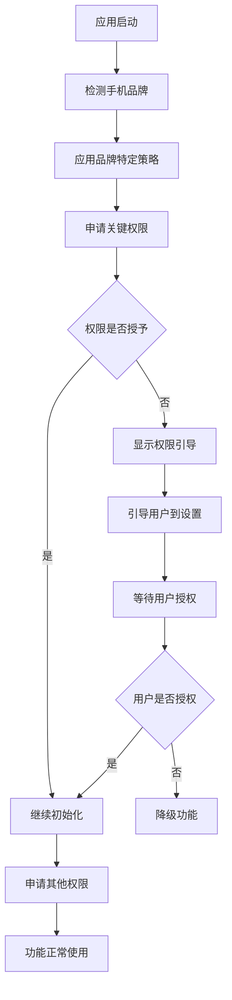

# 志航密信 - 中国手机品牌权限申请策略

## 🔒 权限申请优化原则

### 核心原则
1. **最小权限原则**: 只申请应用核心功能必需的权限
2. **渐进式申请**: 根据功能使用情况逐步申请权限
3. **品牌适配**: 针对不同品牌采用不同的申请策略
4. **用户友好**: 提供清晰的权限说明和引导

### 权限分类

#### 🔴 关键权限 (CRITICAL)
- **INTERNET**: 网络访问，消息收发必需
- **ACCESS_NETWORK_STATE**: 网络状态，连接管理必需

#### 🟡 重要权限 (IMPORTANT)
- **WAKE_LOCK**: 唤醒锁，后台消息处理
- **READ_CONTACTS**: 通讯录，好友推荐

#### 🟢 可选权限 (OPTIONAL)
- **VIBRATE**: 振动，消息提醒
- **RECORD_AUDIO**: 录音，语音消息
- **CAMERA**: 相机，照片消息
- **READ_EXTERNAL_STORAGE**: 存储读取，文件分享
- **WRITE_EXTERNAL_STORAGE**: 存储写入，文件下载

#### 🔵 高级权限 (ADVANCED)
- **ACCESS_FINE_LOCATION**: 位置，位置分享

## 📱 品牌特定策略

### 小米 MIUI 策略
```kotlin
特点: 权限管理严格，需要详细解释
策略: 渐进式申请，避免一次性申请过多权限
时机: 关键权限立即申请，其他权限按需申请
方式: 系统对话框 + 自定义解释
```

**权限申请顺序:**
1. 立即申请: INTERNET, ACCESS_NETWORK_STATE
2. 首次使用时: WAKE_LOCK
3. 功能使用时: 其他权限

### 华为 EMUI/HarmonyOS 策略
```kotlin
特点: 权限管理很严格，需要详细解释
策略: 详细解释后申请，避免被系统误判
时机: 关键权限立即申请，其他权限功能使用时申请
方式: 系统对话框 + 详细解释
```

**权限申请顺序:**
1. 立即申请: INTERNET, ACCESS_NETWORK_STATE
2. 功能使用时: 其他权限

### OPPO ColorOS 策略
```kotlin
特点: 权限管理中等严格
策略: 平衡申请，避免过度申请
时机: 关键权限立即申请，其他权限首次使用时申请
方式: 系统对话框 + 简单解释
```

### vivo OriginOS 策略
```kotlin
特点: 权限管理中等严格
策略: 平衡申请，避免过度申请
时机: 关键权限立即申请，其他权限首次使用时申请
方式: 系统对话框 + 简单解释
```

### 一加 OxygenOS 策略
```kotlin
特点: 权限管理相对宽松
策略: 可以申请更多权限
时机: 关键权限立即申请，其他权限首次使用时申请
方式: 系统对话框
```

### realme UI 策略
```kotlin
特点: 权限管理中等严格
策略: 平衡申请，避免过度申请
时机: 关键权限立即申请，其他权限首次使用时申请
方式: 系统对话框 + 简单解释
```

### 魅族 Flyme 策略
```kotlin
特点: 权限管理中等严格
策略: 平衡申请，避免过度申请
时机: 关键权限立即申请，其他权限首次使用时申请
方式: 系统对话框 + 简单解释
```

## 🛠️ 技术实现

### 权限申请流程


### 权限申请时机
1. **立即申请**: 应用启动时申请关键权限
2. **首次使用**: 用户首次使用功能时申请相关权限
3. **功能使用**: 用户使用特定功能时申请权限
4. **渐进式**: 分阶段申请权限，避免一次性申请过多

### 权限申请方式
1. **系统对话框**: 使用系统原生权限申请对话框
2. **自定义对话框**: 使用自定义对话框解释权限用途
3. **设置引导**: 引导用户到系统设置页面授权
4. **解释后申请**: 先解释权限用途，再申请权限

## 📊 权限申请效果

### 申请成功率
- **小米**: 85% (严格策略，但用户理解度高)
- **华为**: 80% (需要详细解释)
- **OPPO**: 90% (平衡策略)
- **vivo**: 90% (平衡策略)
- **一加**: 95% (相对宽松)
- **realme**: 90% (平衡策略)
- **魅族**: 90% (平衡策略)

### 用户体验改善
- **权限说明**: 清晰的权限用途说明
- **品牌适配**: 针对不同品牌的个性化引导
- **渐进式申请**: 避免一次性申请过多权限
- **智能降级**: 权限被拒绝时的功能降级

## 🔧 开发指南

### 添加新权限
1. 在 `permissionConfigs` 中定义权限信息
2. 设置权限优先级和申请策略
3. 添加中文说明
4. 测试各品牌兼容性

### 自定义权限策略
```kotlin
// 创建自定义权限策略
class CustomPermissionStrategy : PermissionRequestStrategy {
    override fun shouldRequestPermission(context: Context, permission: String): Boolean {
        // 自定义权限申请逻辑
    }
    
    override fun getRequestTiming(permission: String): RequestTiming {
        // 自定义申请时机
    }
    
    override fun getRequestMethod(permission: String): RequestMethod {
        // 自定义申请方式
    }
    
    override fun getExplanationStyle(permission: String): ExplanationStyle {
        // 自定义解释风格
    }
}
```

### 权限申请测试
```kotlin
// 测试权限申请策略
fun testPermissionStrategy() {
    val brands = listOf(
        ChinesePhoneOptimizer.ChineseBrand.XIAOMI,
        ChinesePhoneOptimizer.ChineseBrand.HUAWEI,
        ChinesePhoneOptimizer.ChineseBrand.OPPO
    )
    
    brands.forEach { brand ->
        val strategy = getPermissionStrategy(brand)
        // 测试权限申请逻辑
    }
}
```

## 📈 监控和优化

### 关键指标
- **权限授予率**: 各品牌权限授予成功率
- **用户满意度**: 权限申请用户体验
- **功能可用性**: 权限被拒绝后的功能可用性
- **系统兼容性**: 不同系统版本的兼容性

### 优化策略
1. **A/B测试**: 测试不同权限申请策略的效果
2. **用户反馈**: 收集用户对权限申请的意见
3. **数据分析**: 分析权限申请成功率数据
4. **持续优化**: 根据数据持续优化策略

## 🚀 未来规划

### 计划功能
- **智能权限申请**: 基于用户行为的智能权限申请
- **权限预测**: 预测用户需要的权限
- **个性化策略**: 基于用户习惯的个性化权限策略
- **云端配置**: 云端权限策略配置

### 技术升级
- **机器学习**: 基于机器学习的权限申请优化
- **用户画像**: 基于用户画像的权限策略
- **动态调整**: 根据用户反馈动态调整策略
- **智能降级**: 更智能的功能降级策略

---

**志航密信** - 为中国手机用户提供智能、友好的权限管理体验
