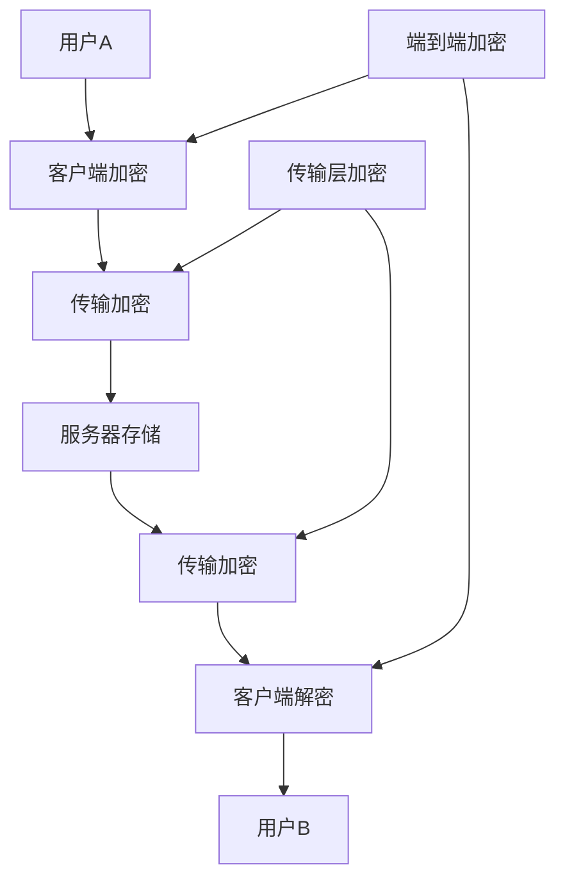

# IM-Suite 端到端加密规范

## 概述

IM-Suite 实现了端到端加密 (E2EE) 功能，确保消息在传输过程中只有发送者和接收者能够解密。本文档描述了加密算法、密钥管理、安全协议等详细规范。

## 加密架构

### 1. 加密层次



### 2. 加密组件

- **端到端加密**: 使用 XChaCha20-Poly1305 算法
- **密钥交换**: 使用 X25519 椭圆曲线
- **传输加密**: 使用 TLS 1.3
- **密钥派生**: 使用 HKDF-SHA256
- **数字签名**: 使用 Ed25519

## 加密算法

### 1. 对称加密

#### XChaCha20-Poly1305
```javascript
// 加密配置
const encryptionConfig = {
  algorithm: 'XChaCha20-Poly1305',
  keySize: 256, // 256 bits
  nonceSize: 192, // 192 bits
  tagSize: 128, // 128 bits
  rounds: 20
};
```

#### 加密流程
```javascript
function encryptMessage(plaintext, key, nonce) {
  // 1. 生成随机 nonce (如果未提供)
  if (!nonce) {
    nonce = crypto.getRandomValues(new Uint8Array(24));
  }
  
  // 2. 使用 XChaCha20-Poly1305 加密
  const ciphertext = xchacha20Poly1305Encrypt(plaintext, key, nonce);
  
  // 3. 返回加密结果
  return {
    ciphertext: ciphertext,
    nonce: nonce,
    algorithm: 'XChaCha20-Poly1305'
  };
}
```

### 2. 非对称加密

#### X25519 密钥交换
```javascript
// 生成密钥对
function generateKeyPair() {
  const keyPair = crypto.subtle.generateKey(
    {
      name: 'X25519',
      namedCurve: 'X25519'
    },
    true,
    ['deriveKey']
  );
  
  return keyPair;
}

// 密钥交换
function performKeyExchange(privateKey, publicKey) {
  return crypto.subtle.deriveKey(
    {
      name: 'X25519',
      public: publicKey
    },
    privateKey,
    {
      name: 'HKDF',
      hash: 'SHA-256',
      salt: new Uint8Array(32),
      info: new Uint8Array(32)
    },
    false,
    ['encrypt', 'decrypt']
  );
}
```

### 3. 数字签名

#### Ed25519 签名
```javascript
// 生成签名密钥对
function generateSignatureKeyPair() {
  return crypto.subtle.generateKey(
    {
      name: 'Ed25519',
      namedCurve: 'Ed25519'
    },
    true,
    ['sign', 'verify']
  );
}

// 签名消息
function signMessage(message, privateKey) {
  return crypto.subtle.sign(
    {
      name: 'Ed25519'
    },
    privateKey,
    message
  );
}

// 验证签名
function verifySignature(message, signature, publicKey) {
  return crypto.subtle.verify(
    {
      name: 'Ed25519'
    },
    publicKey,
    signature,
    message
  );
}
```

## 密钥管理

### 1. 密钥层次结构

```
主密钥 (Master Key)
├── 身份密钥 (Identity Key) - 长期密钥
├── 签名密钥 (Signing Key) - 长期密钥
├── 会话密钥 (Session Key) - 短期密钥
└── 消息密钥 (Message Key) - 临时密钥
```

### 2. 密钥生成

#### 主密钥生成
```javascript
function generateMasterKey() {
  // 使用安全的随机数生成器
  const masterKey = crypto.getRandomValues(new Uint8Array(32));
  
  // 使用 PBKDF2 进行密钥强化
  const strengthenedKey = crypto.subtle.deriveKey(
    {
      name: 'PBKDF2',
      salt: crypto.getRandomValues(new Uint8Array(16)),
      iterations: 100000,
      hash: 'SHA-256'
    },
    masterKey,
    {
      name: 'HKDF',
      hash: 'SHA-256'
    },
    false,
    ['deriveKey']
  );
  
  return strengthenedKey;
}
```

#### 身份密钥生成
```javascript
function generateIdentityKey() {
  return crypto.subtle.generateKey(
    {
      name: 'X25519',
      namedCurve: 'X25519'
    },
    true,
    ['deriveKey']
  );
}
```

#### 会话密钥生成
```javascript
function generateSessionKey(identityKey, ephemeralKey) {
  return crypto.subtle.deriveKey(
    {
      name: 'X25519',
      public: ephemeralKey.publicKey
    },
    identityKey.privateKey,
    {
      name: 'HKDF',
      hash: 'SHA-256',
      salt: crypto.getRandomValues(new Uint8Array(32)),
      info: new TextEncoder().encode('session-key')
    },
    false,
    ['encrypt', 'decrypt']
  );
}
```

### 3. 密钥存储

#### 本地存储
```javascript
class KeyStorage {
  constructor() {
    this.storage = new Map();
  }
  
  // 存储密钥
  async storeKey(keyId, key, encrypted = true) {
    if (encrypted) {
      // 使用主密钥加密存储
      const encryptedKey = await this.encryptKey(key);
      this.storage.set(keyId, encryptedKey);
    } else {
      this.storage.set(keyId, key);
    }
  }
  
  // 获取密钥
  async getKey(keyId, encrypted = true) {
    const storedKey = this.storage.get(keyId);
    if (!storedKey) {
      return null;
    }
    
    if (encrypted) {
      return await this.decryptKey(storedKey);
    } else {
      return storedKey;
    }
  }
  
  // 删除密钥
  deleteKey(keyId) {
    this.storage.delete(keyId);
  }
  
  // 加密密钥
  async encryptKey(key) {
    const masterKey = await this.getMasterKey();
    const nonce = crypto.getRandomValues(new Uint8Array(12));
    const ciphertext = await crypto.subtle.encrypt(
      {
        name: 'AES-GCM',
        iv: nonce
      },
      masterKey,
      key
    );
    
    return {
      ciphertext: new Uint8Array(ciphertext),
      nonce: nonce
    };
  }
  
  // 解密密钥
  async decryptKey(encryptedKey) {
    const masterKey = await this.getMasterKey();
    const plaintext = await crypto.subtle.decrypt(
      {
        name: 'AES-GCM',
        iv: encryptedKey.nonce
      },
      masterKey,
      encryptedKey.ciphertext
    );
    
    return new Uint8Array(plaintext);
  }
}
```

## 安全协议

### 1. 密钥交换协议

#### X3DH (Extended Triple Diffie-Hellman)
```javascript
class X3DHProtocol {
  constructor() {
    this.identityKey = null;
    this.signedPreKey = null;
    this.oneTimePreKeys = [];
  }
  
  // 初始化协议
  async initialize() {
    // 生成身份密钥
    this.identityKey = await generateIdentityKey();
    
    // 生成签名预密钥
    this.signedPreKey = await generateSignedPreKey();
    
    // 生成一次性预密钥
    this.oneTimePreKeys = await generateOneTimePreKeys(100);
  }
  
  // 执行密钥交换
  async performKeyExchange(recipientPublicKey, recipientSignedPreKey, recipientOneTimePreKey) {
    // 1. 生成临时密钥对
    const ephemeralKey = await generateEphemeralKey();
    
    // 2. 计算共享密钥
    const sharedKey1 = await this.computeSharedKey(this.identityKey.privateKey, recipientPublicKey);
    const sharedKey2 = await this.computeSharedKey(ephemeralKey.privateKey, recipientSignedPreKey);
    const sharedKey3 = await this.computeSharedKey(ephemeralKey.privateKey, recipientOneTimePreKey);
    
    // 3. 派生会话密钥
    const sessionKey = await this.deriveSessionKey(sharedKey1, sharedKey2, sharedKey3);
    
    return {
      sessionKey: sessionKey,
      ephemeralPublicKey: ephemeralKey.publicKey
    };
  }
  
  // 计算共享密钥
  async computeSharedKey(privateKey, publicKey) {
    return await crypto.subtle.deriveKey(
      {
        name: 'X25519',
        public: publicKey
      },
      privateKey,
      {
        name: 'HKDF',
        hash: 'SHA-256'
      },
      false,
      ['deriveKey']
    );
  }
  
  // 派生会话密钥
  async deriveSessionKey(sharedKey1, sharedKey2, sharedKey3) {
    const combinedKey = new Uint8Array(96);
    combinedKey.set(sharedKey1, 0);
    combinedKey.set(sharedKey2, 32);
    combinedKey.set(sharedKey3, 64);
    
    return await crypto.subtle.deriveKey(
      {
        name: 'HKDF',
        hash: 'SHA-256',
        salt: crypto.getRandomValues(new Uint8Array(32)),
        info: new TextEncoder().encode('session-key')
      },
      combinedKey,
      {
        name: 'AES-GCM',
        length: 256
      },
      false,
      ['encrypt', 'decrypt']
    );
  }
}
```

### 2. 双棘轮协议 (Double Ratchet)

#### 消息加密
```javascript
class DoubleRatchet {
  constructor() {
    this.rootKey = null;
    this.chainKey = null;
    this.messageKey = null;
    this.messageNumber = 0;
  }
  
  // 初始化棘轮
  async initialize(rootKey) {
    this.rootKey = rootKey;
    this.chainKey = await this.deriveChainKey(rootKey);
    this.messageNumber = 0;
  }
  
  // 加密消息
  async encryptMessage(plaintext) {
    // 1. 派生消息密钥
    this.messageKey = await this.deriveMessageKey(this.chainKey);
    
    // 2. 更新链密钥
    this.chainKey = await this.deriveNextChainKey(this.chainKey);
    
    // 3. 加密消息
    const nonce = crypto.getRandomValues(new Uint8Array(24));
    const ciphertext = await this.encrypt(plaintext, this.messageKey, nonce);
    
    // 4. 增加消息编号
    this.messageNumber++;
    
    return {
      ciphertext: ciphertext,
      nonce: nonce,
      messageNumber: this.messageNumber
    };
  }
  
  // 解密消息
  async decryptMessage(encryptedMessage) {
    // 1. 派生消息密钥
    const messageKey = await this.deriveMessageKey(this.chainKey);
    
    // 2. 更新链密钥
    this.chainKey = await this.deriveNextChainKey(this.chainKey);
    
    // 3. 解密消息
    const plaintext = await this.decrypt(
      encryptedMessage.ciphertext,
      messageKey,
      encryptedMessage.nonce
    );
    
    // 4. 增加消息编号
    this.messageNumber++;
    
    return plaintext;
  }
  
  // 派生链密钥
  async deriveChainKey(rootKey) {
    return await crypto.subtle.deriveKey(
      {
        name: 'HKDF',
        hash: 'SHA-256',
        salt: new Uint8Array(32),
        info: new TextEncoder().encode('chain-key')
      },
      rootKey,
      {
        name: 'HKDF',
        hash: 'SHA-256'
      },
      false,
      ['deriveKey']
    );
  }
  
  // 派生消息密钥
  async deriveMessageKey(chainKey) {
    return await crypto.subtle.deriveKey(
      {
        name: 'HKDF',
        hash: 'SHA-256',
        salt: new Uint8Array(32),
        info: new TextEncoder().encode('message-key')
      },
      chainKey,
      {
        name: 'HKDF',
        hash: 'SHA-256'
      },
      false,
      ['encrypt', 'decrypt']
    );
  }
}
```

## 消息加密

### 1. 消息结构

#### 加密消息格式
```javascript
const encryptedMessage = {
  version: 1,
  algorithm: 'XChaCha20-Poly1305',
  keyId: 'key_123456',
  nonce: new Uint8Array(24),
  ciphertext: new Uint8Array(1024),
  tag: new Uint8Array(16),
  timestamp: Date.now(),
  signature: new Uint8Array(64)
};
```

#### 消息加密流程
```javascript
class MessageEncryption {
  constructor() {
    this.keyStorage = new KeyStorage();
    this.doubleRatchet = new DoubleRatchet();
  }
  
  // 加密消息
  async encryptMessage(plaintext, recipientId) {
    // 1. 获取会话密钥
    const sessionKey = await this.getSessionKey(recipientId);
    
    // 2. 使用双棘轮协议加密
    const encryptedData = await this.doubleRatchet.encryptMessage(plaintext);
    
    // 3. 创建消息结构
    const message = {
      version: 1,
      algorithm: 'XChaCha20-Poly1305',
      keyId: sessionKey.id,
      nonce: encryptedData.nonce,
      ciphertext: encryptedData.ciphertext,
      messageNumber: encryptedData.messageNumber,
      timestamp: Date.now()
    };
    
    // 4. 数字签名
    const signature = await this.signMessage(message);
    message.signature = signature;
    
    return message;
  }
  
  // 解密消息
  async decryptMessage(encryptedMessage, senderId) {
    // 1. 验证签名
    const isValid = await this.verifySignature(encryptedMessage, senderId);
    if (!isValid) {
      throw new Error('消息签名验证失败');
    }
    
    // 2. 获取会话密钥
    const sessionKey = await this.getSessionKey(senderId);
    
    // 3. 使用双棘轮协议解密
    const plaintext = await this.doubleRatchet.decryptMessage(encryptedMessage);
    
    return plaintext;
  }
  
  // 获取会话密钥
  async getSessionKey(contactId) {
    // 从密钥存储中获取会话密钥
    const sessionKey = await this.keyStorage.getKey(`session_${contactId}`);
    if (!sessionKey) {
      // 如果没有会话密钥，执行密钥交换
      await this.performKeyExchange(contactId);
      return await this.keyStorage.getKey(`session_${contactId}`);
    }
    return sessionKey;
  }
}
```

### 2. 阅后即焚消息

#### 自毁消息加密
```javascript
class SelfDestructingMessage {
  constructor() {
    this.timer = null;
    this.messageKey = null;
  }
  
  // 创建自毁消息
  async createSelfDestructingMessage(plaintext, ttlSeconds) {
    // 1. 生成临时密钥
    const messageKey = crypto.getRandomValues(new Uint8Array(32));
    
    // 2. 加密消息
    const nonce = crypto.getRandomValues(new Uint8Array(24));
    const ciphertext = await this.encrypt(plaintext, messageKey, nonce);
    
    // 3. 设置自毁定时器
    this.setSelfDestructTimer(ttlSeconds, messageKey);
    
    return {
      ciphertext: ciphertext,
      nonce: nonce,
      ttl: ttlSeconds,
      algorithm: 'XChaCha20-Poly1305'
    };
  }
  
  // 解密自毁消息
  async decryptSelfDestructingMessage(encryptedMessage, messageKey) {
    const plaintext = await this.decrypt(
      encryptedMessage.ciphertext,
      messageKey,
      encryptedMessage.nonce
    );
    
    // 解密后立即销毁密钥
    this.destroyMessageKey(messageKey);
    
    return plaintext;
  }
  
  // 设置自毁定时器
  setSelfDestructTimer(ttlSeconds, messageKey) {
    this.timer = setTimeout(() => {
      this.destroyMessageKey(messageKey);
    }, ttlSeconds * 1000);
  }
  
  // 销毁消息密钥
  destroyMessageKey(messageKey) {
    // 使用安全的方式清除密钥
    messageKey.fill(0);
    messageKey = null;
  }
}
```

## 传输安全

### 1. TLS 配置

#### 服务器 TLS 配置
```nginx
# Nginx TLS 配置
server {
    listen 443 ssl http2;
    server_name api.im-suite.com;
    
    # SSL 证书配置
    ssl_certificate /etc/ssl/certs/im-suite.crt;
    ssl_certificate_key /etc/ssl/private/im-suite.key;
    
    # TLS 版本配置
    ssl_protocols TLSv1.2 TLSv1.3;
    ssl_ciphers ECDHE-RSA-AES256-GCM-SHA384:ECDHE-RSA-AES128-GCM-SHA256:ECDHE-RSA-AES256-SHA384:ECDHE-RSA-AES128-SHA256;
    ssl_prefer_server_ciphers on;
    
    # HSTS 配置
    add_header Strict-Transport-Security "max-age=31536000; includeSubDomains; preload" always;
    
    # 其他安全头
    add_header X-Frame-Options DENY always;
    add_header X-Content-Type-Options nosniff always;
    add_header X-XSS-Protection "1; mode=block" always;
    add_header Referrer-Policy "strict-origin-when-cross-origin" always;
}
```

#### 客户端 TLS 配置
```javascript
// 客户端 TLS 配置
const tlsConfig = {
  // 强制使用 HTTPS
  forceHttps: true,
  
  // 证书固定
  certificatePinning: {
    'api.im-suite.com': [
      'sha256/AAAAAAAAAAAAAAAAAAAAAAAAAAAAAAAAAAAAAAAAAAA=',
      'sha256/BBBBBBBBBBBBBBBBBBBBBBBBBBBBBBBBBBBBBBBBBBB='
    ]
  },
  
  // 最小 TLS 版本
  minTlsVersion: 'TLSv1.2',
  
  // 支持的密码套件
  ciphers: [
    'ECDHE-RSA-AES256-GCM-SHA384',
    'ECDHE-RSA-AES128-GCM-SHA256',
    'ECDHE-RSA-AES256-SHA384',
    'ECDHE-RSA-AES128-SHA256'
  ]
};
```

### 2. 证书固定

#### 客户端证书固定
```javascript
class CertificatePinning {
  constructor() {
    this.pinnedCertificates = new Map();
  }
  
  // 添加固定证书
  addPinnedCertificate(hostname, certificates) {
    this.pinnedCertificates.set(hostname, certificates);
  }
  
  // 验证证书
  async verifyCertificate(hostname, certificate) {
    const pinnedCerts = this.pinnedCertificates.get(hostname);
    if (!pinnedCerts) {
      return true; // 没有固定证书，允许通过
    }
    
    // 计算证书哈希
    const certHash = await this.calculateCertificateHash(certificate);
    
    // 检查是否匹配
    return pinnedCerts.includes(certHash);
  }
  
  // 计算证书哈希
  async calculateCertificateHash(certificate) {
    const certBuffer = await certificate.arrayBuffer();
    const hashBuffer = await crypto.subtle.digest('SHA-256', certBuffer);
    const hashArray = new Uint8Array(hashBuffer);
    const hashBase64 = btoa(String.fromCharCode(...hashArray));
    return `sha256/${hashBase64}`;
  }
}
```

## 安全审计

### 1. 安全检查清单

#### 加密实现检查
```javascript
class SecurityAudit {
  constructor() {
    this.checks = [];
  }
  
  // 执行安全审计
  async performSecurityAudit() {
    const results = {
      encryption: await this.checkEncryption(),
      keyManagement: await this.checkKeyManagement(),
      transmission: await this.checkTransmission(),
      storage: await this.checkStorage(),
      authentication: await this.checkAuthentication()
    };
    
    return results;
  }
  
  // 检查加密实现
  async checkEncryption() {
    const checks = [
      this.checkAlgorithmStrength(),
      this.checkKeySize(),
      this.checkRandomness(),
      this.checkImplementation()
    ];
    
    const results = await Promise.all(checks);
    return {
      passed: results.every(r => r.passed),
      details: results
    };
  }
  
  // 检查算法强度
  async checkAlgorithmStrength() {
    const algorithms = [
      'XChaCha20-Poly1305',
      'AES-256-GCM',
      'X25519',
      'Ed25519'
    ];
    
    const supported = algorithms.every(alg => {
      return crypto.subtle.getSupportedAlgorithms().includes(alg);
    });
    
    return {
      passed: supported,
      message: supported ? '所有加密算法都受支持' : '部分加密算法不受支持'
    };
  }
  
  // 检查密钥大小
  async checkKeySize() {
    const keySizes = {
      'XChaCha20-Poly1305': 256,
      'AES-256-GCM': 256,
      'X25519': 256,
      'Ed25519': 256
    };
    
    const valid = Object.entries(keySizes).every(([alg, size]) => {
      return this.getKeySize(alg) >= size;
    });
    
    return {
      passed: valid,
      message: valid ? '密钥大小符合要求' : '密钥大小不符合要求'
    };
  }
}
```

### 2. 安全测试

#### 加密测试
```javascript
class EncryptionTest {
  constructor() {
    this.testResults = [];
  }
  
  // 运行所有测试
  async runAllTests() {
    const tests = [
      this.testSymmetricEncryption(),
      this.testAsymmetricEncryption(),
      this.testKeyExchange(),
      this.testMessageEncryption(),
      this.testSelfDestructingMessages()
    ];
    
    const results = await Promise.all(tests);
    return results;
  }
  
  // 测试对称加密
  async testSymmetricEncryption() {
    try {
      const key = await crypto.subtle.generateKey(
      {
        name: 'AES-GCM',
        length: 256
      },
      true,
      ['encrypt', 'decrypt']
    );
    
    const plaintext = new TextEncoder().encode('测试消息');
    const iv = crypto.getRandomValues(new Uint8Array(12));
    
    const ciphertext = await crypto.subtle.encrypt(
      {
        name: 'AES-GCM',
        iv: iv
      },
      key,
      plaintext
    );
    
    const decrypted = await crypto.subtle.decrypt(
      {
        name: 'AES-GCM',
        iv: iv
      },
      key,
      ciphertext
    );
    
    const success = new TextDecoder().decode(decrypted) === '测试消息';
    
    return {
      test: '对称加密',
      passed: success,
      message: success ? '对称加密测试通过' : '对称加密测试失败'
    };
  } catch (error) {
    return {
      test: '对称加密',
      passed: false,
      message: '对称加密测试失败: ' + error.message
    };
  }
}
```

## 最佳实践

### 1. 开发建议
- 使用经过验证的加密库
- 定期更新加密算法
- 实现完整的错误处理
- 进行安全代码审查
- 使用自动化安全测试

### 2. 部署建议
- 使用强密码和证书
- 定期轮换密钥
- 监控安全事件
- 备份加密密钥
- 实施访问控制

### 3. 维护建议
- 定期安全审计
- 更新安全补丁
- 监控异常活动
- 培训开发团队
- 建立安全响应流程
