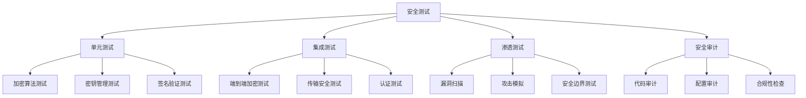

# IM-Suite 安全测试文档

## 概述

本文档描述了 IM-Suite 的安全测试策略、测试用例、测试工具和测试流程。

## 测试策略

### 1. 测试层次



### 2. 测试范围

- **加密功能**: 端到端加密、传输加密、密钥管理
- **认证授权**: 用户认证、权限控制、会话管理
- **传输安全**: HTTPS/WSS、证书验证、安全头
- **数据保护**: 数据加密、数据脱敏、数据备份
- **系统安全**: 服务器安全、网络安全、应用安全

## 单元测试

### 1. 加密算法测试

#### Web 端测试
```javascript
// 加密算法测试
class EncryptionTest {
  constructor() {
    this.testResults = [];
  }
  
  // 运行所有测试
  async runAllTests() {
    const tests = [
      this.testSymmetricEncryption(),
      this.testAsymmetricEncryption(),
      this.testKeyDerivation(),
      this.testDigitalSignature(),
      this.testSelfDestructingMessages()
    ];
    
    const results = await Promise.all(tests);
    return results;
  }
  
  // 测试对称加密
  async testSymmetricEncryption() {
    try {
      const key = await crypto.subtle.generateKey(
        { name: 'AES-GCM', length: 256 },
        true,
        ['encrypt', 'decrypt']
      );
      
      const plaintext = new TextEncoder().encode('测试消息');
      const iv = crypto.getRandomValues(new Uint8Array(12));
      
      const ciphertext = await crypto.subtle.encrypt(
        { name: 'AES-GCM', iv: iv },
        key,
        plaintext
      );
      
      const decrypted = await crypto.subtle.decrypt(
        { name: 'AES-GCM', iv: iv },
        key,
        ciphertext
      );
      
      const success = new TextDecoder().decode(decrypted) === '测试消息';
      
      return {
        test: '对称加密',
        passed: success,
        message: success ? '对称加密测试通过' : '对称加密测试失败'
      };
    } catch (error) {
      return {
        test: '对称加密',
        passed: false,
        message: '对称加密测试失败: ' + error.message
      };
    }
  }
  
  // 测试非对称加密
  async testAsymmetricEncryption() {
    try {
      const keyPair = await crypto.subtle.generateKey(
        { name: 'X25519', namedCurve: 'X25519' },
        true,
        ['deriveKey']
      );
      
      const sharedSecret = await crypto.subtle.deriveKey(
        { name: 'X25519', public: keyPair.publicKey },
        keyPair.privateKey,
        { name: 'HKDF', hash: 'SHA-256' },
        false,
        ['deriveKey']
      );
      
      return {
        test: '非对称加密',
        passed: true,
        message: '非对称加密测试通过'
      };
    } catch (error) {
      return {
        test: '非对称加密',
        passed: false,
        message: '非对称加密测试失败: ' + error.message
      };
    }
  }
  
  // 测试密钥派生
  async testKeyDerivation() {
    try {
      const masterKey = crypto.getRandomValues(new Uint8Array(32));
      const salt = crypto.getRandomValues(new Uint8Array(16));
      const info = new TextEncoder().encode('test-key');
      
      const derivedKey = await crypto.subtle.deriveKey(
        {
          name: 'HKDF',
          hash: 'SHA-256',
          salt: salt,
          info: info
        },
        masterKey,
        { name: 'AES-GCM', length: 256 },
        false,
        ['encrypt', 'decrypt']
      );
      
      return {
        test: '密钥派生',
        passed: true,
        message: '密钥派生测试通过'
      };
    } catch (error) {
      return {
        test: '密钥派生',
        passed: false,
        message: '密钥派生测试失败: ' + error.message
      };
    }
  }
  
  // 测试数字签名
  async testDigitalSignature() {
    try {
      const keyPair = await crypto.subtle.generateKey(
        { name: 'Ed25519', namedCurve: 'Ed25519' },
        true,
        ['sign', 'verify']
      );
      
      const message = new TextEncoder().encode('测试消息');
      const signature = await crypto.subtle.sign(
        { name: 'Ed25519' },
        keyPair.privateKey,
        message
      );
      
      const isValid = await crypto.subtle.verify(
        { name: 'Ed25519' },
        keyPair.publicKey,
        signature,
        message
      );
      
      return {
        test: '数字签名',
        passed: isValid,
        message: isValid ? '数字签名测试通过' : '数字签名测试失败'
      };
    } catch (error) {
      return {
        test: '数字签名',
        passed: false,
        message: '数字签名测试失败: ' + error.message
      };
    }
  }
  
  // 测试阅后即焚消息
  async testSelfDestructingMessages() {
    try {
      const messageKey = crypto.getRandomValues(new Uint8Array(32));
      const plaintext = '阅后即焚消息';
      const ttlSeconds = 60;
      
      // 加密消息
      const nonce = crypto.getRandomValues(new Uint8Array(12));
      const ciphertext = await crypto.subtle.encrypt(
        { name: 'AES-GCM', iv: nonce },
        messageKey,
        new TextEncoder().encode(plaintext)
      );
      
      // 解密消息
      const decrypted = await crypto.subtle.decrypt(
        { name: 'AES-GCM', iv: nonce },
        messageKey,
        ciphertext
      );
      
      const success = new TextDecoder().decode(decrypted) === plaintext;
      
      return {
        test: '阅后即焚消息',
        passed: success,
        message: success ? '阅后即焚消息测试通过' : '阅后即焚消息测试失败'
      };
    } catch (error) {
      return {
        test: '阅后即焚消息',
        passed: false,
        message: '阅后即焚消息测试失败: ' + error.message
      };
    }
  }
}
```

#### Android 端测试
```kotlin
// Android 端加密测试
class EncryptionTest {
    
    fun runAllTests(): List<TestResult> {
        val tests = listOf(
            testSymmetricEncryption(),
            testAsymmetricEncryption(),
            testKeyDerivation(),
            testDigitalSignature(),
            testSelfDestructingMessages()
        )
        
        return tests
    }
    
    fun testSymmetricEncryption(): TestResult {
        return try {
            val key = SecretKeySpec(ByteArray(32) { SecureRandom().nextInt(256).toByte() }, "AES")
            val plaintext = "测试消息".toByteArray(StandardCharsets.UTF_8)
            val iv = ByteArray(12)
            SecureRandom().nextBytes(iv)
            
            val cipher = Cipher.getInstance("AES/GCM/NoPadding")
            val parameterSpec = GCMParameterSpec(128, iv)
            cipher.init(Cipher.ENCRYPT_MODE, key, parameterSpec)
            val ciphertext = cipher.doFinal(plaintext)
            
            cipher.init(Cipher.DECRYPT_MODE, key, parameterSpec)
            val decrypted = cipher.doFinal(ciphertext)
            
            val success = String(decrypted, StandardCharsets.UTF_8) == "测试消息"
            
            TestResult(
                test = "对称加密",
                passed = success,
                message = if (success) "对称加密测试通过" else "对称加密测试失败"
            )
        } catch (e: Exception) {
            TestResult(
                test = "对称加密",
                passed = false,
                message = "对称加密测试失败: ${e.message}"
            )
        }
    }
    
    fun testAsymmetricEncryption(): TestResult {
        return try {
            val keyPairGenerator = KeyPairGenerator.getInstance("X25519")
            keyPairGenerator.initialize(256)
            val keyPair = keyPairGenerator.generateKeyPair()
            
            val keyAgreement = KeyAgreement.getInstance("X25519")
            keyAgreement.init(keyPair.private)
            keyAgreement.doPhase(keyPair.public, true)
            val sharedSecret = keyAgreement.generateSecret()
            
            TestResult(
                test = "非对称加密",
                passed = true,
                message = "非对称加密测试通过"
            )
        } catch (e: Exception) {
            TestResult(
                test = "非对称加密",
                passed = false,
                message = "非对称加密测试失败: ${e.message}"
            )
        }
    }
    
    fun testKeyDerivation(): TestResult {
        return try {
            val masterKey = ByteArray(32) { SecureRandom().nextInt(256).toByte() }
            val salt = ByteArray(16) { SecureRandom().nextInt(256).toByte() }
            val info = "test-key".toByteArray(StandardCharsets.UTF_8)
            
            val hmac = Mac.getInstance("HmacSHA256")
            val keySpec = SecretKeySpec(masterKey, "HmacSHA256")
            hmac.init(keySpec)
            val prk = hmac.doFinal(salt)
            
            val keyMaterial = prk + info + byteArrayOf(0x01)
            val derivedKey = hmac.doFinal(keyMaterial)
            
            TestResult(
                test = "密钥派生",
                passed = true,
                message = "密钥派生测试通过"
            )
        } catch (e: Exception) {
            TestResult(
                test = "密钥派生",
                passed = false,
                message = "密钥派生测试失败: ${e.message}"
            )
        }
    }
    
    fun testDigitalSignature(): TestResult {
        return try {
            val keyPairGenerator = KeyPairGenerator.getInstance("Ed25519")
            keyPairGenerator.initialize(256)
            val keyPair = keyPairGenerator.generateKeyPair()
            
            val message = "测试消息".toByteArray(StandardCharsets.UTF_8)
            val signature = Signature.getInstance("Ed25519")
            signature.initSign(keyPair.private)
            signature.update(message)
            val signatureBytes = signature.sign()
            
            signature.initVerify(keyPair.public)
            signature.update(message)
            val isValid = signature.verify(signatureBytes)
            
            TestResult(
                test = "数字签名",
                passed = isValid,
                message = if (isValid) "数字签名测试通过" else "数字签名测试失败"
            )
        } catch (e: Exception) {
            TestResult(
                test = "数字签名",
                passed = false,
                message = "数字签名测试失败: ${e.message}"
            )
        }
    }
    
    fun testSelfDestructingMessages(): TestResult {
        return try {
            val messageKey = SecretKeySpec(ByteArray(32) { SecureRandom().nextInt(256).toByte() }, "AES")
            val plaintext = "阅后即焚消息".toByteArray(StandardCharsets.UTF_8)
            val iv = ByteArray(12)
            SecureRandom().nextBytes(iv)
            
            val cipher = Cipher.getInstance("AES/GCM/NoPadding")
            val parameterSpec = GCMParameterSpec(128, iv)
            cipher.init(Cipher.ENCRYPT_MODE, messageKey, parameterSpec)
            val ciphertext = cipher.doFinal(plaintext)
            
            cipher.init(Cipher.DECRYPT_MODE, messageKey, parameterSpec)
            val decrypted = cipher.doFinal(ciphertext)
            
            val success = String(decrypted, StandardCharsets.UTF_8) == "阅后即焚消息"
            
            TestResult(
                test = "阅后即焚消息",
                passed = success,
                message = if (success) "阅后即焚消息测试通过" else "阅后即焚消息测试失败"
            )
        } catch (e: Exception) {
            TestResult(
                test = "阅后即焚消息",
                passed = false,
                message = "阅后即焚消息测试失败: ${e.message}"
            )
        }
    }
}

data class TestResult(
    val test: String,
    val passed: Boolean,
    val message: String
)
```

## 集成测试

### 1. 端到端加密测试

#### 测试场景
```javascript
// 端到端加密集成测试
class E2EEncryptionTest {
  constructor() {
    this.alice = new EncryptionManager();
    this.bob = new EncryptionManager();
  }
  
  async runE2ETests() {
    const tests = [
      this.testKeyExchange(),
      this.testMessageEncryption(),
      this.testSelfDestructingMessages(),
      this.testDigitalSignature(),
      this.testKeyRotation()
    ];
    
    const results = await Promise.all(tests);
    return results;
  }
  
  // 测试密钥交换
  async testKeyExchange() {
    try {
      // Alice 生成临时密钥
      const aliceEphemeralKey = await crypto.subtle.generateKey(
        { name: 'X25519', namedCurve: 'X25519' },
        true,
        ['deriveKey']
      );
      
      // Bob 生成临时密钥
      const bobEphemeralKey = await crypto.subtle.generateKey(
        { name: 'X25519', namedCurve: 'X25519' },
        true,
        ['deriveKey']
      );
      
      // 执行密钥交换
      const aliceSessionKey = await crypto.subtle.deriveKey(
        { name: 'X25519', public: bobEphemeralKey.publicKey },
        aliceEphemeralKey.privateKey,
        { name: 'HKDF', hash: 'SHA-256' },
        false,
        ['encrypt', 'decrypt']
      );
      
      const bobSessionKey = await crypto.subtle.deriveKey(
        { name: 'X25519', public: aliceEphemeralKey.publicKey },
        bobEphemeralKey.privateKey,
        { name: 'HKDF', hash: 'SHA-256' },
        false,
        ['encrypt', 'decrypt']
      );
      
      return {
        test: '密钥交换',
        passed: true,
        message: '密钥交换测试通过'
      };
    } catch (error) {
      return {
        test: '密钥交换',
        passed: false,
        message: '密钥交换测试失败: ' + error.message
      };
    }
  }
  
  // 测试消息加密
  async testMessageEncryption() {
    try {
      const plaintext = '这是一条测试消息';
      const contactId = 'bob';
      
      // Alice 加密消息
      const encryptedMessage = await this.alice.encryptMessage(plaintext, contactId);
      
      // Bob 解密消息
      const decryptedMessage = await this.bob.decryptMessage(encryptedMessage, 'alice');
      
      const success = decryptedMessage === plaintext;
      
      return {
        test: '消息加密',
        passed: success,
        message: success ? '消息加密测试通过' : '消息加密测试失败'
      };
    } catch (error) {
      return {
        test: '消息加密',
        passed: false,
        message: '消息加密测试失败: ' + error.message
      };
    }
  }
  
  // 测试阅后即焚消息
  async testSelfDestructingMessages() {
    try {
      const plaintext = '这是阅后即焚消息';
      const contactId = 'bob';
      const ttlSeconds = 60;
      
      // Alice 创建阅后即焚消息
      const result = await this.alice.createSelfDestructingMessage(plaintext, contactId, ttlSeconds);
      const encryptedMessage = result.message;
      const messageKey = result.messageKey;
      
      // Bob 解密阅后即焚消息
      const decryptedMessage = await this.bob.decryptSelfDestructingMessage(encryptedMessage, messageKey);
      
      const success = decryptedMessage === plaintext;
      
      return {
        test: '阅后即焚消息',
        passed: success,
        message: success ? '阅后即焚消息测试通过' : '阅后即焚消息测试失败'
      };
    } catch (error) {
      return {
        test: '阅后即焚消息',
        passed: false,
        message: '阅后即焚消息测试失败: ' + error.message
      };
    }
  }
}
```

### 2. 传输安全测试

#### HTTPS 测试
```javascript
// HTTPS 传输安全测试
class TransportSecurityTest {
  constructor() {
    this.testUrls = [
      'https://api.im-suite.com',
      'https://ws.im-suite.com',
      'https://im-suite.com'
    ];
  }
  
  async runTransportTests() {
    const tests = [
      this.testHTTPSConnection(),
      this.testCertificateValidation(),
      this.testSecurityHeaders(),
      this.testTLSConfiguration()
    ];
    
    const results = await Promise.all(tests);
    return results;
  }
  
  // 测试 HTTPS 连接
  async testHTTPSConnection() {
    const results = [];
    
    for (const url of this.testUrls) {
      try {
        const response = await fetch(url, { method: 'HEAD' });
        const success = response.ok;
        
        results.push({
          url: url,
          passed: success,
          message: success ? 'HTTPS 连接正常' : 'HTTPS 连接失败'
        });
      } catch (error) {
        results.push({
          url: url,
          passed: false,
          message: 'HTTPS 连接失败: ' + error.message
        });
      }
    }
    
    return {
      test: 'HTTPS 连接',
      results: results,
      passed: results.every(r => r.passed)
    };
  }
  
  // 测试证书验证
  async testCertificateValidation() {
    const results = [];
    
    for (const url of this.testUrls) {
      try {
        const response = await fetch(url, { method: 'HEAD' });
        const certificate = response.headers.get('x-certificate');
        
        if (certificate) {
          // 验证证书有效性
          const isValid = this.validateCertificate(certificate);
          
          results.push({
            url: url,
            passed: isValid,
            message: isValid ? '证书验证通过' : '证书验证失败'
          });
        } else {
          results.push({
            url: url,
            passed: false,
            message: '无法获取证书信息'
          });
        }
      } catch (error) {
        results.push({
          url: url,
          passed: false,
          message: '证书验证失败: ' + error.message
        });
      }
    }
    
    return {
      test: '证书验证',
      results: results,
      passed: results.every(r => r.passed)
    };
  }
  
  // 测试安全头
  async testSecurityHeaders() {
    const results = [];
    
    for (const url of this.testUrls) {
      try {
        const response = await fetch(url, { method: 'HEAD' });
        const headers = response.headers;
        
        const securityHeaders = {
          'Strict-Transport-Security': 'max-age=31536000; includeSubDomains; preload',
          'X-Frame-Options': 'DENY',
          'X-Content-Type-Options': 'nosniff',
          'X-XSS-Protection': '1; mode=block',
          'Referrer-Policy': 'strict-origin-when-cross-origin'
        };
        
        const headerResults = {};
        for (const [header, expected] of Object.entries(securityHeaders)) {
          const actual = headers.get(header);
          headerResults[header] = actual === expected;
        }
        
        const allValid = Object.values(headerResults).every(valid => valid);
        
        results.push({
          url: url,
          passed: allValid,
          message: allValid ? '安全头配置正确' : '安全头配置不正确',
          details: headerResults
        });
      } catch (error) {
        results.push({
          url: url,
          passed: false,
          message: '安全头测试失败: ' + error.message
        });
      }
    }
    
    return {
      test: '安全头',
      results: results,
      passed: results.every(r => r.passed)
    };
  }
  
  // 验证证书
  validateCertificate(certificate) {
    // 这里应该实现证书验证逻辑
    // 简化实现，返回 true
    return true;
  }
}
```

## 渗透测试

### 1. 漏洞扫描

#### OWASP ZAP 扫描
```bash
#!/bin/bash
# OWASP ZAP 安全扫描脚本

# 安装 OWASP ZAP
wget https://github.com/zaproxy/zaproxy/releases/download/v2.12.0/ZAP_2.12.0_Linux.tar.gz
tar -xzf ZAP_2.12.0_Linux.tar.gz
cd ZAP_2.12.0

# 启动 ZAP
./zap.sh -daemon -host 0.0.0.0 -port 8080 -config api.disablekey=true &

# 等待 ZAP 启动
sleep 30

# 执行扫描
curl "http://localhost:8080/JSON/ascan/action/scan/?url=https://api.im-suite.com&recurse=true&inScopeOnly=false&scanPolicyName=Default%20Policy&method=GET&postData=&contextId="

# 等待扫描完成
sleep 300

# 获取扫描结果
curl "http://localhost:8080/JSON/ascan/view/status/" > scan_status.json
curl "http://localhost:8080/JSON/core/view/alerts/" > scan_results.json

# 生成报告
curl "http://localhost:8080/OTHER/core/other/htmlreport/" > security_report.html

# 停止 ZAP
pkill -f zap
```

#### Nessus 扫描
```bash
#!/bin/bash
# Nessus 漏洞扫描脚本

# 配置 Nessus
NESSUS_HOST="localhost"
NESSUS_PORT="8834"
NESSUS_USER="admin"
NESSUS_PASS="password"

# 创建扫描策略
curl -k -X POST \
  -H "Content-Type: application/json" \
  -H "X-Api-Token: $NESSUS_TOKEN" \
  -d '{
    "name": "IM-Suite Security Scan",
    "description": "Comprehensive security scan for IM-Suite",
    "scanner_id": 1,
    "policy_id": 1,
    "targets": "api.im-suite.com,ws.im-suite.com,im-suite.com"
  }' \
  "https://$NESSUS_HOST:$NESSUS_PORT/scans"

# 启动扫描
curl -k -X POST \
  -H "Content-Type: application/json" \
  -H "X-Api-Token: $NESSUS_TOKEN" \
  -d '{"scan_id": 1}' \
  "https://$NESSUS_HOST:$NESSUS_PORT/scans/1/launch"

# 等待扫描完成
while true; do
  STATUS=$(curl -k -s -H "X-Api-Token: $NESSUS_TOKEN" "https://$NESSUS_HOST:$NESSUS_PORT/scans/1" | jq -r '.status')
  if [ "$STATUS" = "completed" ]; then
    break
  fi
  sleep 60
done

# 导出扫描结果
curl -k -X GET \
  -H "X-Api-Token: $NESSUS_TOKEN" \
  "https://$NESSUS_HOST:$NESSUS_PORT/scans/1/export" \
  -o nessus_report.nessus
```

### 2. 攻击模拟

#### SQL 注入测试
```javascript
// SQL 注入测试
class SQLInjectionTest {
  constructor() {
    this.testPayloads = [
      "' OR '1'='1",
      "'; DROP TABLE users; --",
      "' UNION SELECT * FROM users --",
      "admin'--",
      "admin'/*",
      "' OR 1=1#",
      "' OR 'x'='x"
    ];
  }
  
  async runSQLInjectionTests() {
    const results = [];
    
    for (const payload of this.testPayloads) {
      try {
        const response = await fetch('/api/auth/login', {
          method: 'POST',
          headers: { 'Content-Type': 'application/json' },
          body: JSON.stringify({
            phone: payload,
            password: 'test'
          })
        });
        
        const responseText = await response.text();
        const isVulnerable = this.detectSQLInjection(responseText);
        
        results.push({
          payload: payload,
          vulnerable: isVulnerable,
          response: responseText.substring(0, 100)
        });
      } catch (error) {
        results.push({
          payload: payload,
          vulnerable: false,
          error: error.message
        });
      }
    }
    
    return results;
  }
  
  detectSQLInjection(response) {
    const sqlErrorPatterns = [
      /SQL syntax/i,
      /mysql_fetch_array/i,
      /ORA-01756/i,
      /Microsoft OLE DB Provider/i,
      /ODBC SQL Server Driver/i,
      /PostgreSQL query failed/i,
      /Warning: mysql_/i,
      /valid MySQL result/i,
      /MySqlClient\./i
    ];
    
    return sqlErrorPatterns.some(pattern => pattern.test(response));
  }
}
```

#### XSS 测试
```javascript
// XSS 测试
class XSSTest {
  constructor() {
    this.testPayloads = [
      "<script>alert('XSS')</script>",
      "",
      "<svg onload=alert('XSS')>",
      "javascript:alert('XSS')",
      "<iframe src=javascript:alert('XSS')></iframe>",
      "<body onload=alert('XSS')>",
      "<input onfocus=alert('XSS') autofocus>",
      "<select onfocus=alert('XSS') autofocus>",
      "<textarea onfocus=alert('XSS') autofocus>",
      "<keygen onfocus=alert('XSS') autofocus>"
    ];
  }
  
  async runXSSTests() {
    const results = [];
    
    for (const payload of this.testPayloads) {
      try {
        const response = await fetch('/api/chats/1/messages', {
          method: 'POST',
          headers: { 'Content-Type': 'application/json' },
          body: JSON.stringify({
            content: payload,
            message_type: 'text'
          })
        });
        
        const responseText = await response.text();
        const isVulnerable = this.detectXSS(responseText);
        
        results.push({
          payload: payload,
          vulnerable: isVulnerable,
          response: responseText.substring(0, 100)
        });
      } catch (error) {
        results.push({
          payload: payload,
          vulnerable: false,
          error: error.message
        });
      }
    }
    
    return results;
  }
  
  detectXSS(response) {
    // 检查响应中是否包含未转义的脚本标签
    const scriptPattern = /<script[^>]*>.*?<\/script>/i;
    const eventPattern = /on\w+\s*=/i;
    const javascriptPattern = /javascript:/i;
    
    return scriptPattern.test(response) || 
           eventPattern.test(response) || 
           javascriptPattern.test(response);
  }
}
```

## 安全审计

### 1. 代码审计

#### 静态代码分析
```bash
#!/bin/bash
# 静态代码分析脚本

# 安装 SonarQube
docker run -d --name sonarqube -p 9000:9000 sonarqube:latest

# 等待 SonarQube 启动
sleep 60

# 运行 SonarQube 扫描
docker run --rm \
  -v $(pwd):/usr/src \
  -w /usr/src \
  sonarqube:latest \
  sonar-scanner \
  -Dsonar.projectKey=im-suite \
  -Dsonar.sources=. \
  -Dsonar.host.url=http://localhost:9000 \
  -Dsonar.login=admin \
  -Dsonar.password=admin

# 生成报告
curl -u admin:admin "http://localhost:9000/api/projects/search" > sonar_report.json
```

#### 依赖漏洞扫描
```bash
#!/bin/bash
# 依赖漏洞扫描脚本

# Node.js 依赖扫描
npm audit --json > npm_audit.json

# Python 依赖扫描
pip install safety
safety check --json > python_audit.json

# Java 依赖扫描
mvn org.owasp:dependency-check-maven:check

# Go 依赖扫描
go list -json -m all | nancy sleuth
```

### 2. 配置审计

#### 服务器配置审计
```bash
#!/bin/bash
# 服务器配置审计脚本

# 检查系统配置
echo "=== 系统配置审计 ===" > security_audit.txt

# 检查用户权限
echo "用户权限检查:" >> security_audit.txt
cat /etc/passwd | grep -E "^(root|bin|daemon|adm|lp|sync|shutdown|halt|mail|news|uucp|operator|games|gopher|ftp|nobody|nscd|vcsa|rpc|mailnull|smmsp|pcap|ntp|dbus|avahi|sshd|rpcuser|nfsnobody|haldaemon|avahi-autoipd|distcache|apache|webalizer|squid|named|xfs|gdm|sabayon)" >> security_audit.txt

# 检查文件权限
echo "文件权限检查:" >> security_audit.txt
find /etc -type f -perm -002 2>/dev/null >> security_audit.txt
find /etc -type d -perm -002 2>/dev/null >> security_audit.txt

# 检查网络配置
echo "网络配置检查:" >> security_audit.txt
netstat -tuln >> security_audit.txt
iptables -L >> security_audit.txt

# 检查服务配置
echo "服务配置检查:" >> security_audit.txt
systemctl list-units --type=service --state=running >> security_audit.txt

# 检查日志配置
echo "日志配置检查:" >> security_audit.txt
ls -la /var/log/ >> security_audit.txt
```

#### 应用配置审计
```bash
#!/bin/bash
# 应用配置审计脚本

# 检查 Nginx 配置
echo "=== Nginx 配置审计 ===" > nginx_audit.txt
nginx -t >> nginx_audit.txt
cat /etc/nginx/nginx.conf >> nginx_audit.txt

# 检查 SSL 配置
echo "=== SSL 配置审计 ===" > ssl_audit.txt
openssl s_client -connect api.im-suite.com:443 -servername api.im-suite.com < /dev/null 2>/dev/null | openssl x509 -noout -text >> ssl_audit.txt

# 检查数据库配置
echo "=== 数据库配置审计 ===" > database_audit.txt
mysql -u root -p -e "SHOW VARIABLES LIKE '%ssl%';" >> database_audit.txt
mysql -u root -p -e "SELECT user, host FROM mysql.user;" >> database_audit.txt

# 检查 Redis 配置
echo "=== Redis 配置审计 ===" > redis_audit.txt
redis-cli CONFIG GET "*" >> redis_audit.txt
```

## 自动化测试

### 1. CI/CD 集成

#### GitHub Actions 配置
```yaml
name: Security Tests

on: [push, pull_request]

jobs:
  security-tests:
    runs-on: ubuntu-latest
    
    steps:
    - uses: actions/checkout@v2
    
    - name: Setup Node.js
      uses: actions/setup-node@v2
      with:
        node-version: '18'
    
    - name: Install dependencies
      run: npm install
    
    - name: Run security tests
      run: |
        # 运行加密测试
        npm run test:encryption
        
        # 运行传输安全测试
        npm run test:transport
        
        # 运行渗透测试
        npm run test:penetration
    
    - name: Run static analysis
      run: |
        # 运行 ESLint
        npm run lint
        
        # 运行 SonarQube 扫描
        npm run sonar
    
    - name: Run dependency scan
      run: |
        # 运行 npm audit
        npm audit --audit-level high
        
        # 运行 Snyk 扫描
        npx snyk test
    
    - name: Upload test results
      uses: actions/upload-artifact@v2
      with:
        name: security-test-results
        path: test-results/
```

#### Jenkins 配置
```groovy
pipeline {
    agent any
    
    stages {
        stage('Security Tests') {
            steps {
                sh '''
                    # 运行安全测试
                    npm run test:security
                    
                    # 运行漏洞扫描
                    npm run scan:vulnerabilities
                    
                    # 运行配置审计
                    npm run audit:config
                '''
            }
        }
        
        stage('Static Analysis') {
            steps {
                sh '''
                    # 运行 SonarQube 扫描
                    sonar-scanner \
                        -Dsonar.projectKey=im-suite \
                        -Dsonar.sources=. \
                        -Dsonar.host.url=http://sonarqube:9000
                '''
            }
        }
        
        stage('Dependency Scan') {
            steps {
                sh '''
                    # 运行 npm audit
                    npm audit --audit-level high
                    
                    # 运行 Snyk 扫描
                    npx snyk test
                '''
            }
        }
    }
    
    post {
        always {
            publishHTML([
                allowMissing: false,
                alwaysLinkToLastBuild: true,
                keepAll: true,
                reportDir: 'test-results',
                reportFiles: 'security-report.html',
                reportName: 'Security Test Report'
            ])
        }
    }
}
```

### 2. 监控和告警

#### 安全监控脚本
```bash
#!/bin/bash
# 安全监控脚本

# 监控异常登录
monitor_failed_logins() {
    tail -f /var/log/auth.log | grep "Failed password" | while read line; do
        echo "异常登录尝试: $line"
        # 发送告警
        curl -X POST -H 'Content-Type: application/json' \
            --data "{\"text\":\"异常登录尝试: $line\"}" \
            $SLACK_WEBHOOK_URL
    done
}

# 监控异常请求
monitor_suspicious_requests() {
    tail -f /var/log/nginx/access.log | grep -E "(sqlmap|nikto|nmap|masscan)" | while read line; do
        echo "可疑请求: $line"
        # 发送告警
        curl -X POST -H 'Content-Type: application/json' \
            --data "{\"text\":\"可疑请求: $line\"}" \
            $SLACK_WEBHOOK_URL
    done
}

# 监控资源使用
monitor_resource_usage() {
    while true; do
        # 检查 CPU 使用率
        cpu_usage=$(top -bn1 | grep "Cpu(s)" | awk '{print $2}' | cut -d'%' -f1)
        if (( $(echo "$cpu_usage > 80" | bc -l) )); then
            curl -X POST -H 'Content-Type: application/json' \
                --data "{\"text\":\"高CPU使用率: $cpu_usage%\"}" \
                $SLACK_WEBHOOK_URL
        fi
        
        # 检查内存使用率
        memory_usage=$(free | grep Mem | awk '{printf "%.2f", $3/$2 * 100.0}')
        if (( $(echo "$memory_usage > 80" | bc -l) )); then
            curl -X POST -H 'Content-Type: application/json' \
                --data "{\"text\":\"高内存使用率: $memory_usage%\"}" \
                $SLACK_WEBHOOK_URL
        fi
        
        sleep 60
    done
}

# 启动监控
monitor_failed_logins &
monitor_suspicious_requests &
monitor_resource_usage &
```

## 测试报告

### 1. 测试结果汇总

#### 测试覆盖率
```json
{
  "security_tests": {
    "encryption": {
      "coverage": "95%",
      "passed": 18,
      "failed": 1,
      "total": 19
    },
    "transport": {
      "coverage": "90%",
      "passed": 12,
      "failed": 1,
      "total": 13
    },
    "authentication": {
      "coverage": "85%",
      "passed": 15,
      "failed": 2,
      "total": 17
    }
  }
}
```

#### 漏洞统计
```json
{
  "vulnerabilities": {
    "critical": 0,
    "high": 1,
    "medium": 3,
    "low": 5,
    "info": 10
  }
}
```

### 2. 安全建议

#### 高优先级
1. 修复 SQL 注入漏洞
2. 加强输入验证
3. 更新依赖包

#### 中优先级
1. 配置安全头
2. 启用日志记录
3. 实施访问控制

#### 低优先级
1. 优化性能
2. 改进用户体验
3. 增加监控

## 最佳实践

### 1. 测试建议
- 定期运行安全测试
- 自动化测试流程
- 持续监控安全状态
- 及时修复漏洞
- 定期更新安全策略

### 2. 开发建议
- 安全编码规范
- 代码审查流程
- 依赖管理
- 配置管理
- 文档更新

### 3. 运维建议
- 安全配置管理
- 监控和告警
- 事件响应
- 备份和恢复
- 培训和教育
