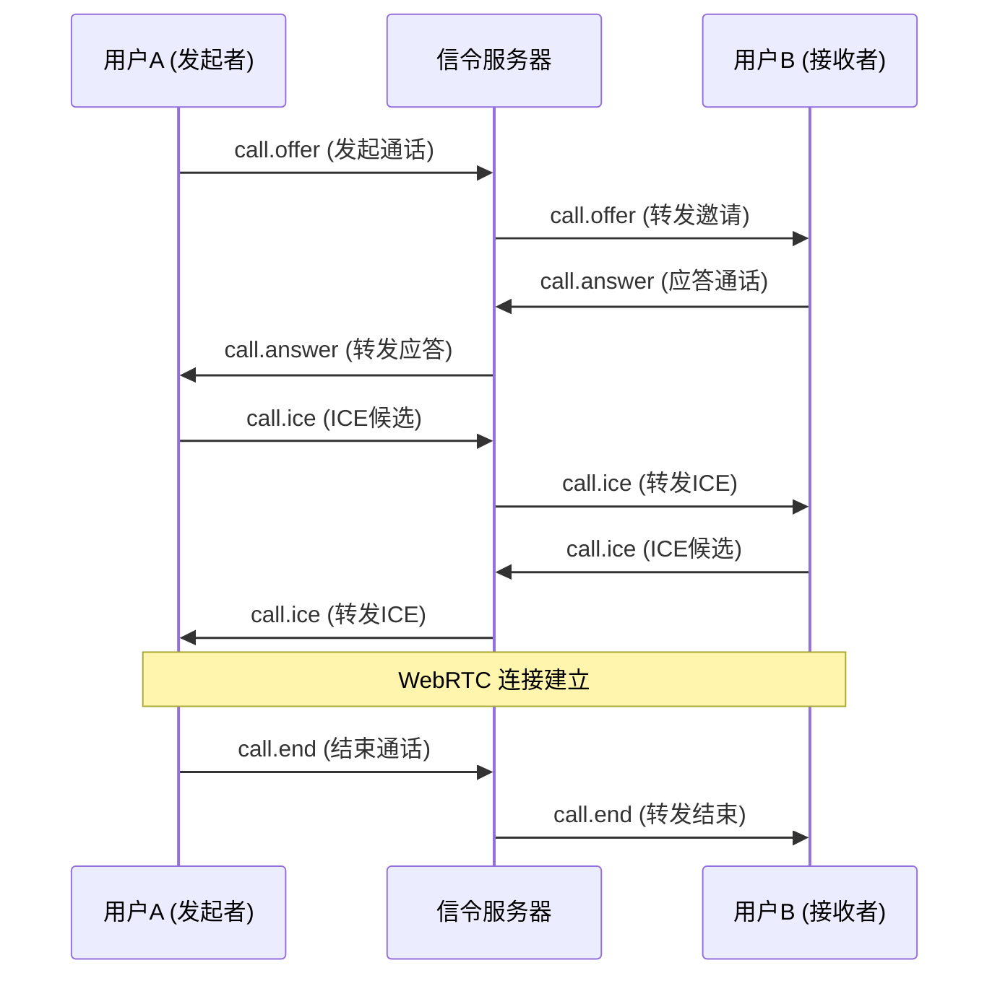

# IM-Suite WebRTC 信令协议

## 概述

IM-Suite 使用 WebSocket 作为 WebRTC 信令通道，实现语音和视频通话功能。信令协议基于 JSON 格式，通过现有的 WebSocket 连接进行传输。

## 信令流程

### 1. 通话建立流程



### 2. 信令消息格式

所有信令消息都遵循以下格式：

```json
{
  "type": "信令类型",
  "payload": {
    "信令数据"
  },
  "timestamp": "2025-10-07T12:00:00Z"
}
```

## 信令类型

### 1. 通话邀请 (call.offer)

#### 发起通话
```json
{
  "type": "call.offer",
  "payload": {
    "call_id": "call_123456789",
    "from_user": 1,
    "to_user": 2,
    "call_type": "video",
    "sdp": {
      "type": "offer",
      "sdp": "v=0\r\no=- 1234567890 1234567890 IN IP4 127.0.0.1\r\ns=-\r\nt=0 0\r\na=group:BUNDLE 0 1\r\na=msid-semantic: WMS\r\nm=audio 9 UDP/TLS/RTP/SAVPF 111 103 104 9 0 8 106 105 13 110 112 113 126\r\nc=IN IP4 127.0.0.1\r\na=rtcp:9 IN IP4 127.0.0.1\r\na=ice-ufrag:abc123\r\na=ice-pwd:def456\r\na=ice-options:trickle\r\na=fingerprint:sha-256 12:34:56:78:90:AB:CD:EF:12:34:56:78:90:AB:CD:EF:12:34:56:78:90:AB:CD:EF:12:34:56:78:90:AB:CD:EF\r\na=setup:actpass\r\na=mid:0\r\na=sendrecv\r\na=rtcp-mux\r\na=rtpmap:111 opus/48000/2\r\na=rtcp-fb:111 transport-cc\r\na=fmtp:111 minptime=10;useinbandfec=1\r\na=rtpmap:103 ISAC/16000\r\na=rtpmap:104 ISAC/32000\r\na=rtpmap:9 G722/8000\r\na=rtpmap:0 PCMU/8000\r\na=rtpmap:8 PCMA/8000\r\na=rtpmap:106 CN/32000\r\na=rtpmap:105 CN/16000\r\na=rtpmap:13 CN/8000\r\na=rtpmap:110 telephone-event/48000\r\na=rtpmap:112 telephone-event/16000\r\na=rtpmap:113 telephone-event/8000\r\na=rtpmap:126 telephone-event/8000\r\nm=video 9 UDP/TLS/RTP/SAVPF 96 97 98 99 100 101 102 122 127 125 107 108 109 124 120 123 119 114 115 116\r\nc=IN IP4 127.0.0.1\r\na=rtcp:9 IN IP4 127.0.0.1\r\na=ice-ufrag:abc123\r\na=ice-pwd:def456\r\na=ice-options:trickle\r\na=fingerprint:sha-256 12:34:56:78:90:AB:CD:EF:12:34:56:78:90:AB:CD:EF:12:34:56:78:90:AB:CD:EF:12:34:56:78:90:AB:CD:EF\r\na=setup:actpass\r\na=mid:1\r\na=sendrecv\r\na=rtcp-mux\r\na=rtcp-rsize\r\na=rtpmap:96 VP8/90000\r\na=rtcp-fb:96 ccm fir\r\na=rtcp-fb:96 nack\r\na=rtcp-fb:96 nack pli\r\na=rtcp-fb:96 goog-remb\r\na=rtcp-fb:96 transport-cc\r\na=rtpmap:97 rtx/90000\r\na=fmtp:97 apt=96\r\na=rtpmap:98 VP9/90000\r\na=rtcp-fb:98 ccm fir\r\na=rtcp-fb:98 nack\r\na=rtcp-fb:98 nack pli\r\na=rtcp-fb:98 goog-remb\r\na=rtcp-fb:98 transport-cc\r\na=rtpmap:99 rtx/90000\r\na=fmtp:99 apt=98\r\na=rtpmap:100 H264/90000\r\na=rtcp-fb:100 ccm fir\r\na=rtcp-fb:100 nack\r\na=rtcp-fb:100 nack pli\r\na=rtcp-fb:100 goog-remb\r\na=rtcp-fb:100 transport-cc\r\na=rtpmap:101 rtx/90000\r\na=fmtp:101 apt=100\r\na=rtpmap:102 H264/90000\r\na=rtcp-fb:102 ccm fir\r\na=rtcp-fb:102 nack\r\na=rtcp-fb:102 nack pli\r\na=rtcp-fb:102 goog-remb\r\na=rtcp-fb:102 transport-cc\r\na=rtpmap:122 rtx/90000\r\na=fmtp:122 apt=102\r\na=rtpmap:127 H264/90000\r\na=rtcp-fb:127 ccm fir\r\na=rtcp-fb:127 nack\r\na=rtcp-fb:127 nack pli\r\na=rtcp-fb:127 goog-remb\r\na=rtcp-fb:127 transport-cc\r\na=rtpmap:125 rtx/90000\r\na=fmtp:125 apt=127\r\na=rtpmap:107 H264/90000\r\na=rtcp-fb:107 ccm fir\r\na=rtcp-fb:107 nack\r\na=rtcp-fb:107 nack pli\r\na=rtcp-fb:107 goog-remb\r\na=rtcp-fb:107 transport-cc\r\na=rtpmap:108 rtx/90000\r\na=fmtp:108 apt=107\r\na=rtpmap:109 H264/90000\r\na=rtcp-fb:109 ccm fir\r\na=rtcp-fb:109 nack\r\na=rtcp-fb:109 nack pli\r\na=rtcp-fb:109 goog-remb\r\na=rtcp-fb:109 transport-cc\r\na=rtpmap:124 rtx/90000\r\na=fmtp:124 apt=109\r\na=rtpmap:120 H264/90000\r\na=rtcp-fb:120 ccm fir\r\na=rtcp-fb:120 nack\r\na=rtcp-fb:120 nack pli\r\na=rtcp-fb:120 goog-remb\r\na=rtcp-fb:120 transport-cc\r\na=rtpmap:123 rtx/90000\r\na=fmtp:123 apt=120\r\na=rtpmap:119 H264/90000\r\na=rtcp-fb:119 ccm fir\r\na=rtcp-fb:119 nack\r\na=rtcp-fb:119 nack pli\r\na=rtcp-fb:119 goog-remb\r\na=rtcp-fb:119 transport-cc\r\na=rtpmap:114 rtx/90000\r\na=fmtp:114 apt=119\r\na=rtpmap:115 H264/90000\r\na=rtcp-fb:115 ccm fir\r\na=rtcp-fb:115 nack\r\na=rtcp-fb:115 nack pli\r\na=rtcp-fb:115 goog-remb\r\na=rtcp-fb:115 transport-cc\r\na=rtpmap:116 rtx/90000\r\na=fmtp:116 apt=115"
    },
    "ice_candidates": [
      {
        "candidate": "candidate:1 1 UDP 2113667326 192.168.1.100 54400 typ host",
        "sdpMLineIndex": 0,
        "sdpMid": "0"
      },
      {
        "candidate": "candidate:2 1 UDP 1694498814 203.0.113.1 54402 typ srflx raddr 192.168.1.100 rport 54400",
        "sdpMLineIndex": 0,
        "sdpMid": "0"
      }
    ],
    "constraints": {
      "audio": true,
      "video": true,
      "audio_codecs": ["opus", "PCMU", "PCMA"],
      "video_codecs": ["VP8", "VP9", "H264"],
      "max_bandwidth": 2000000
    },
    "created_at": "2025-10-07T12:00:00Z"
  },
  "timestamp": "2025-10-07T12:00:00Z"
}
```

#### 字段说明
- `call_id`: 唯一通话标识符
- `from_user`: 发起者用户ID
- `to_user`: 接收者用户ID
- `call_type`: 通话类型 ("audio" 或 "video")
- `sdp`: SDP 会话描述
- `ice_candidates`: ICE 候选列表
- `constraints`: 媒体约束条件

### 2. 通话应答 (call.answer)

#### 应答通话
```json
{
  "type": "call.answer",
  "payload": {
    "call_id": "call_123456789",
    "from_user": 2,
    "to_user": 1,
    "sdp": {
      "type": "answer",
      "sdp": "v=0\r\no=- 1234567890 1234567890 IN IP4 127.0.0.1\r\ns=-\r\nt=0 0\r\na=group:BUNDLE 0 1\r\na=msid-semantic: WMS\r\nm=audio 9 UDP/TLS/RTP/SAVPF 111 103 104 9 0 8 106 105 13 110 112 113 126\r\nc=IN IP4 127.0.0.1\r\na=rtcp:9 IN IP4 127.0.0.1\r\na=ice-ufrag:xyz789\r\na=ice-pwd:uvw012\r\na=ice-options:trickle\r\na=fingerprint:sha-256 12:34:56:78:90:AB:CD:EF:12:34:56:78:90:AB:CD:EF:12:34:56:78:90:AB:CD:EF:12:34:56:78:90:AB:CD:EF\r\na=setup:active\r\na=mid:0\r\na=sendrecv\r\na=rtcp-mux\r\na=rtpmap:111 opus/48000/2\r\na=rtcp-fb:111 transport-cc\r\na=fmtp:111 minptime=10;useinbandfec=1\r\na=rtpmap:103 ISAC/16000\r\na=rtpmap:104 ISAC/32000\r\na=rtpmap:9 G722/8000\r\na=rtpmap:0 PCMU/8000\r\na=rtpmap:8 PCMA/8000\r\na=rtpmap:106 CN/32000\r\na=rtpmap:105 CN/16000\r\na=rtpmap:13 CN/8000\r\na=rtpmap:110 telephone-event/48000\r\na=rtpmap:112 telephone-event/16000\r\na=rtpmap:113 telephone-event/8000\r\na=rtpmap:126 telephone-event/8000\r\nm=video 9 UDP/TLS/RTP/SAVPF 96 97 98 99 100 101 102 122 127 125 107 108 109 124 120 123 119 114 115 116\r\nc=IN IP4 127.0.0.1\r\na=rtcp:9 IN IP4 127.0.0.1\r\na=ice-ufrag:xyz789\r\na=ice-pwd:uvw012\r\na=ice-options:trickle\r\na=fingerprint:sha-256 12:34:56:78:90:AB:CD:EF:12:34:56:78:90:AB:CD:EF:12:34:56:78:90:AB:CD:EF:12:34:56:78:90:AB:CD:EF\r\na=setup:active\r\na=mid:1\r\na=sendrecv\r\na=rtcp-mux\r\na=rtcp-rsize\r\na=rtpmap:96 VP8/90000\r\na=rtcp-fb:96 ccm fir\r\na=rtcp-fb:96 nack\r\na=rtcp-fb:96 nack pli\r\na=rtcp-fb:96 goog-remb\r\na=rtcp-fb:96 transport-cc\r\na=rtpmap:97 rtx/90000\r\na=fmtp:97 apt=96\r\na=rtpmap:98 VP9/90000\r\na=rtcp-fb:98 ccm fir\r\na=rtcp-fb:98 nack\r\na=rtcp-fb:98 nack pli\r\na=rtcp-fb:98 goog-remb\r\na=rtcp-fb:98 transport-cc\r\na=rtpmap:99 rtx/90000\r\na=fmtp:99 apt=98\r\na=rtpmap:100 H264/90000\r\na=rtcp-fb:100 ccm fir\r\na=rtcp-fb:100 nack\r\na=rtcp-fb:100 nack pli\r\na=rtcp-fb:100 goog-remb\r\na=rtcp-fb:100 transport-cc\r\na=rtpmap:101 rtx/90000\r\na=fmtp:101 apt=100\r\na=rtpmap:102 H264/90000\r\na=rtcp-fb:102 ccm fir\r\na=rtcp-fb:102 nack\r\na=rtcp-fb:102 nack pli\r\na=rtcp-fb:102 goog-remb\r\na=rtcp-fb:102 transport-cc\r\na=rtpmap:122 rtx/90000\r\na=fmtp:122 apt=102\r\na=rtpmap:127 H264/90000\r\na=rtcp-fb:127 ccm fir\r\na=rtcp-fb:127 nack\r\na=rtcp-fb:127 nack pli\r\na=rtcp-fb:127 goog-remb\r\na=rtcp-fb:127 transport-cc\r\na=rtpmap:125 rtx/90000\r\na=fmtp:125 apt=127\r\na=rtpmap:107 H264/90000\r\na=rtcp-fb:107 ccm fir\r\na=rtcp-fb:107 nack\r\na=rtcp-fb:107 nack pli\r\na=rtcp-fb:107 goog-remb\r\na=rtcp-fb:107 transport-cc\r\na=rtpmap:108 rtx/90000\r\na=fmtp:108 apt=107\r\na=rtpmap:109 H264/90000\r\na=rtcp-fb:109 ccm fir\r\na=rtcp-fb:109 nack\r\na=rtcp-fb:109 nack pli\r\na=rtcp-fb:109 goog-remb\r\na=rtcp-fb:109 transport-cc\r\na=rtpmap:124 rtx/90000\r\na=fmtp:124 apt=109\r\na=rtpmap:120 H264/90000\r\na=rtcp-fb:120 ccm fir\r\na=rtcp-fb:120 nack\r\na=rtcp-fb:120 nack pli\r\na=rtcp-fb:120 goog-remb\r\na=rtcp-fb:120 transport-cc\r\na=rtpmap:123 rtx/90000\r\na=fmtp:123 apt=120\r\na=rtpmap:119 H264/90000\r\na=rtcp-fb:119 ccm fir\r\na=rtcp-fb:119 nack\r\na=rtcp-fb:119 nack pli\r\na=rtcp-fb:119 goog-remb\r\na=rtcp-fb:119 transport-cc\r\na=rtpmap:114 rtx/90000\r\na=fmtp:114 apt=119\r\na=rtpmap:115 H264/90000\r\na=rtcp-fb:115 ccm fir\r\na=rtcp-fb:115 nack\r\na=rtcp-fb:115 nack pli\r\na=rtcp-fb:115 goog-remb\r\na=rtcp-fb:115 transport-cc\r\na=rtpmap:116 rtx/90000\r\na=fmtp:116 apt=115"
    },
    "ice_candidates": [
      {
        "candidate": "candidate:1 1 UDP 2113667326 192.168.1.101 54401 typ host",
        "sdpMLineIndex": 0,
        "sdpMid": "0"
      },
      {
        "candidate": "candidate:2 1 UDP 1694498814 203.0.113.2 54403 typ srflx raddr 192.168.1.101 rport 54401",
        "sdpMLineIndex": 0,
        "sdpMid": "0"
      }
    ],
    "answered_at": "2025-10-07T12:00:00Z"
  },
  "timestamp": "2025-10-07T12:00:00Z"
}
```

### 3. ICE 候选交换 (call.ice)

#### 发送 ICE 候选
```json
{
  "type": "call.ice",
  "payload": {
    "call_id": "call_123456789",
    "from_user": 1,
    "to_user": 2,
    "ice_candidate": {
      "candidate": "candidate:3 1 UDP 1694498814 203.0.113.1 54404 typ srflx raddr 192.168.1.100 rport 54400",
      "sdpMLineIndex": 0,
      "sdpMid": "0"
    }
  },
  "timestamp": "2025-10-07T12:00:00Z"
}
```

### 4. 通话结束 (call.end)

#### 结束通话
```json
{
  "type": "call.end",
  "payload": {
    "call_id": "call_123456789",
    "from_user": 1,
    "to_user": 2,
    "reason": "user_hangup",
    "duration": 120,
    "ended_at": "2025-10-07T12:02:00Z"
  },
  "timestamp": "2025-10-07T12:02:00Z"
}
```

#### 结束原因
- `user_hangup`: 用户主动挂断
- `user_busy`: 用户忙线
- `user_rejected`: 用户拒绝
- `network_error`: 网络错误
- `timeout`: 超时
- `server_error`: 服务器错误

### 5. 通话状态更新 (call.status)

#### 状态更新
```json
{
  "type": "call.status",
  "payload": {
    "call_id": "call_123456789",
    "status": "connected",
    "duration": 60,
    "audio_quality": "good",
    "video_quality": "good",
    "network_stats": {
      "packet_loss": 0.01,
      "jitter": 5,
      "rtt": 50
    }
  },
  "timestamp": "2025-10-07T12:01:00Z"
}
```

#### 状态类型
- `ringing`: 响铃中
- `answered`: 已应答
- `connected`: 已连接
- `disconnected`: 已断开
- `failed`: 失败

## 媒体约束

### 1. 音频约束
```json
{
  "audio": {
    "enabled": true,
    "codecs": ["opus", "PCMU", "PCMA"],
    "sample_rate": 48000,
    "channels": 2,
    "bitrate": 64000,
    "echo_cancellation": true,
    "noise_suppression": true,
    "auto_gain_control": true
  }
}
```

### 2. 视频约束
```json
{
  "video": {
    "enabled": true,
    "codecs": ["VP8", "VP9", "H264"],
    "resolution": {
      "width": 1280,
      "height": 720
    },
    "frame_rate": 30,
    "bitrate": 2000000,
    "aspect_ratio": "16:9"
  }
}
```

### 3. 网络约束
```json
{
  "network": {
    "max_bandwidth": 2000000,
    "min_bandwidth": 64000,
    "prefer_hd": true,
    "fallback_to_audio": true
  }
}
```

## 错误处理

### 1. 信令错误
```json
{
  "type": "call.error",
  "payload": {
    "call_id": "call_123456789",
    "error_code": "SIGNALING_ERROR",
    "error_message": "信令处理失败",
    "details": {
      "reason": "SDP解析错误"
    }
  },
  "timestamp": "2025-10-07T12:00:00Z"
}
```

### 2. 媒体错误
```json
{
  "type": "call.error",
  "payload": {
    "call_id": "call_123456789",
    "error_code": "MEDIA_ERROR",
    "error_message": "媒体处理失败",
    "details": {
      "reason": "无法获取摄像头权限"
    }
  },
  "timestamp": "2025-10-07T12:00:00Z"
}
```

### 3. 网络错误
```json
{
  "type": "call.error",
  "payload": {
    "call_id": "call_123456789",
    "error_code": "NETWORK_ERROR",
    "error_message": "网络连接失败",
    "details": {
      "reason": "ICE连接失败"
    }
  },
  "timestamp": "2025-10-07T12:00:00Z"
}
```

## 安全考虑

### 1. 信令安全
- 所有信令消息都通过已认证的 WebSocket 连接传输
- 使用 JWT 令牌进行身份验证
- 信令消息内容加密（可选）

### 2. 媒体安全
- 使用 DTLS-SRTP 加密媒体流
- 支持端到端加密（可选）
- 媒体密钥通过信令通道安全交换

### 3. 权限控制
- 检查用户是否有通话权限
- 验证通话参与者身份
- 防止未授权的通话访问

## 性能优化

### 1. 信令优化
- 使用二进制格式减少消息大小
- 实现信令消息压缩
- 优化 ICE 候选收集

### 2. 媒体优化
- 动态调整视频质量
- 实现带宽自适应
- 支持硬件加速

### 3. 网络优化
- 使用 TURN 服务器进行 NAT 穿透
- 实现网络质量监控
- 支持网络切换

## 实现建议

### 1. 客户端实现
- 使用 WebRTC API 进行媒体处理
- 实现信令消息处理逻辑
- 处理各种错误情况

### 2. 服务器实现
- 实现信令消息路由
- 管理通话状态
- 提供 TURN 服务器

### 3. 测试验证
- 实现信令协议测试
- 进行媒体质量测试
- 验证网络适应性
